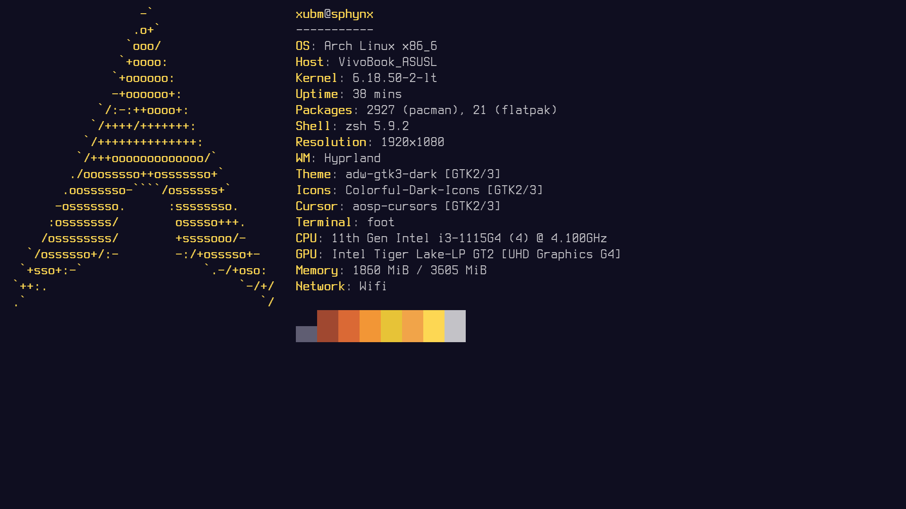

# Arch Hyprland Rice — portable dotfiles

A complete Hyprland desktop rice for Arch Linux: dynamic-island Quickshell
bar (with Waybar themes as an alternative), pywal/matugen theming, rofi
launchers, foot + kitty terminals, zsh (oh-my-zsh) and a wallpaper/gif
workflow. Works for **any username, any hostname, any hardware** — start from
a fresh minimal Arch install and run one command.




## Requirements

- Arch Linux (or derivative with `pacman`), internet access
- A normal user account with `sudo` (wheel) — never run the installer as pure
  root-only; it detects your user automatically
- ~4 GB free for packages

## Installation (fresh Arch)

```bash
sudo pacman -S --needed git base-devel
git clone https://github.com/xubmxd/dotfiles.git ~/dotfiles
cd ~/dotfiles
./install.sh
```

This installs the Hyprland + Hyprlock + Quickshell environment only.
Waybar is explicitly out of scope for this installer iteration.

Useful options (`./install.sh --help` for all):

| Flag | Effect |
| --- | --- |
| `--yes` | Non-interactive |
| `--no-aur` | Skip AUR packages (pywal, lyricsmpris source, emoji modi) |
| `--deploy-only` | Only deploy configs + theming + verification (no packages/services) |
| `--display-manager=ly\|none` | Enable the `ly` login manager (default: none — TTY login, then `uwsm start hyprland-uwsm.desktop`) |

What the installer does:

1. Verifies Arch + privileges, detects the current user (`USERNAME=` overrides,
   never configures `root`)
2. Installs the minimal Hyprland environment set
   (`installer/packages-hyprland.txt` — every entry names the config that
   requires it) and AUR complements (`installer/packages-hyprland-aur.txt`)
   via `yay`, bootstrapped **as your user** (never builds AUR packages as root)
3. Deploys `hypr/ quickshell/ wal/ rofi/ foot/ xdg-desktop-portal/ uwsm/
   matugen/` into `~/.config` with **timestamped backups**
   (`~/.local/share/dotfiles-backups/…`) — safe to re-run (idempotent)
4. Writes portable monitor defaults (no forced modes) for copied installs,
   links the `lyricsmpris` backend, makes helper scripts executable
5. Bootstraps wallpaper + pywal/matugen colors so `hyprland.conf`'s
   `colors-hyprland.conf` source and quickshell's `colors.json` always exist
6. Enables NetworkManager/Bluetooth system units and PipeWire user units
7. Verifies every required binary + config file and runs
   `Hyprland --verify-config` before declaring success

> The repo does **not** need to live at `~/.config`: cloning anywhere and
> running `./install.sh` copies the rice into place. Cloning directly to
> `~/.config` also works (in-place mode).

## First boot

1. Log in on TTY, then run: `uwsm start hyprland-uwsm.desktop` (or `Hyprland`)
2. Put wallpapers in `~/Pictures/wallpapers/` (and GIFs in `~/Pictures/gifs/`)
3. `Super + apostrophe` opens the wallpaper picker, `Super + ;` a random one

Hardware notes:

- **Monitors**: copied installs default to no forced modes (Hyprland
  auto-configures every output). Run `hyprctl monitors`, then pin a specific
  output in `~/.config/hypr/source-configs/monitors.lua` if desired.
- **Laptops vs desktops**: battery/backlight modules degrade gracefully when
  the hardware is absent. Bluetooth UI does nothing harmful without a radio.

## Updating

```bash
cd ~/rice && git pull && ./install.sh
```

## Uninstallation

```bash
./uninstall.sh        # removes deployed files, restores latest backup
```

Packages, services, hostname and bootloader changes are intentionally left
alone (see script output for details).

## Package lists

| File | Contents |
| --- | --- |
| `installer/packages-hyprland.txt` | Minimal Hyprland-environment set (always installed) |
| `installer/packages-hyprland-aur.txt` | AUR complements: pywal, lyricsmpris source, emoji modi (skipped with `--no-aur`) |
| `pkglist-desktop.txt` / `pkglist-aur.txt` | Legacy full-desktop snapshots — NOT used by `install.sh` |

## What's configured

| Directory | App |
| --- | --- |
| `hypr/` | Hyprland (Lua config + `scripts/`) |
| `quickshell/` | Dynamic-island bar (default status bar) |
| `waybar/` (+`themes/`) | Alternative bar, 8 themes |
| `rofi/`, `wofi/` | Launchers |
| `foot/`, `kitty/` | Terminals |
| `fish/`, `zsh/` | Shells (default: zsh + oh-my-zsh) |
| `nvim/`, `zed/` | Editors |
| `fastfetch/`, `btop/`, `cava/` | System info / monitors |
| `yazi/` | File manager |
| `swaync/`, `dunst/` | Notifications |
| `wal/` | pywal templates |

## Portability check

```bash
./tools/check-portability.sh          # or --strict in CI
```

Scans tracked files for hardcoded `/home/*` paths, hostnames, monitor/device
names and installer regressions.

## GUI testing (headless)

```bash
Hyprland --verify-config -c ~/.config/hypr/hyprland.lua   # pure config check
./tools/test-gui-headless.sh      # boots the real config (needs GPU/TTY/VM)
./tools/test-gui-components.sh    # container-safe: sway headless parent +
                                  # rice quickshell + foot + screenshots
```

`test-gui-headless.sh` boots the actual `hyprland.lua`, opens a client and
screenshots it. It cannot run in unprivileged containers (Hyprland's headless
backend is mandatory and needs a GPU allocator) — there it exits 2 with an
explanation. `test-gui-components.sh` covers that gap: it runs the rice's
quickshell bar and terminal under a software-rendered parent compositor and
asserts on layer surfaces, IPC and screenshot pixels. This already caught one
real bug: quickshell needs `qt6-5compat`, now in `installer/packages-hyprland.txt`.

## Troubleshooting

- **No theme on first boot**: pick any wallpaper (`Super + '`) — pywal +
  matugen generate all app colors from it.
- **PipeWire units failed during install**: log in once, then run the
  `systemctl --user enable …` line the installer printed.
- **No login prompt**: you chose `--display-manager=none`; log in on TTY and
  run `uwsm start hyprland-uwsm.desktop`, or re-run with
  `--display-manager=ly`.
- **Full log**: every run appends to `/tmp/dotfiles-install.log`.
- **Secrets are not in this repo** (`~/.zshrc` API keys, VPN profiles, …) —
  restore those from your own backup.
